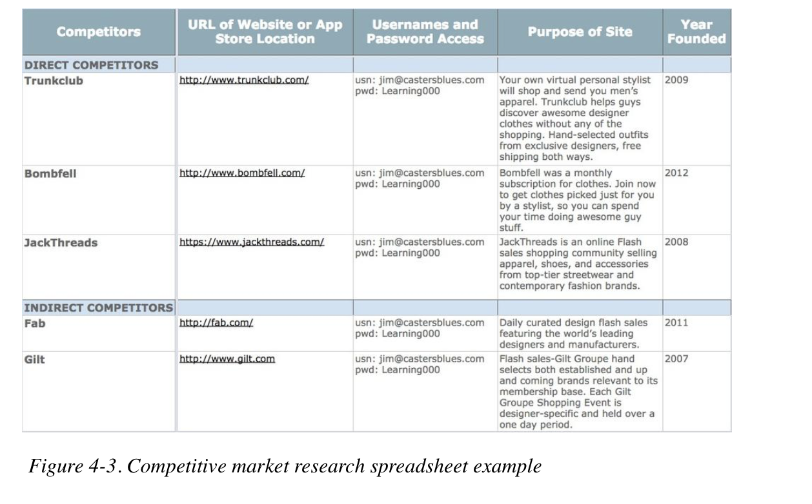

# Chapter 4: Conducting Competitive Research

## Goal:

1. Learn how it works.
2. Good thing \(Competitive advantage\)
3. Pain point

## Competitive Market Research Spreadsheet

### Ultimate Goal:

Devise a solution that creates a competitive advantage

Killer UX design with just a slightly different shade of color \(**Nuance**\)

### What to Do:

1. First-hand knowledge of good and bad user experience
2. Keep track of everything
3. Cloud-based Google Spreadsheet: share with teammate

## Who are the competitors

### Direct Competitors:

Companies that offer the same or very similar value proposition to your current or future customers.

### Indirect Competitors:

Companies that offer a similar value proposition to a different customer segment.

Or your customer base is using an aspect of an indirecr competitor's interface to solve the problem that our soon-to-be-amazing product will!

\(People often use products or combinations of products in ways that the product makers do not expect\)

Example: Airbnb for wedding venue.

### How to find Competitors

1. Ask users, stakeholders, client, investors, and other product owners.
2. Tool: Google-generalized research, Yahoo
   *  Putting in keywords that Target user use 
3. Niche media sites or blog--Top 10 list
4. Crunchbase: collates the largest dataset of startup activity
5. Google Adwords 

#### Principle of finding competitors:

* Try different permutations of keyword searches by using quotations
* Be systematic and review all the links
* Look through at least 5 pages

## How to conduct competitor analysis

### Preparation

1. Use Tempate and set your own personalized variables since there might be attributes that needs to be considered or need not to be considered for your product.
2. Separate rows for Desktop version and App version since they provide distinctive user experience.
3. Username and Password Access for both buyer and seller or just user \(Stay **Covert!**\)

### What to Research \(Quantitive & Qualitative\)

### How and what to Ask during research

* Purpose of site: 
  * About ot About Us
  * Crunchbase
  * iTunes or Google Play App
  * Social Networks
  * Online annual report
* Year founded
  * What players are new to the market or have been on the market for a while
* Funding rounds
  * Crunchbase or the official website of the product
* Revenue streams
  * Spend more time as a user on the website to find what is valuable for the product \(what you pay as a user is the valuable service of the product\)
  * Annual report
  * Membership fee
* Monthly traffic
  * Compete.com
  * Quantcast
  * Alexa
  * App Annie
  * App figures
  * Mopapp
  * Distimo
  * Appflier
* of SKUs /Videos/Articles/listings
  * What is the total result of one product
  * Is it actually offering what it is promising to the user
* Primary category
  * What are the most active/popular/selling categories
* Social Networks
  * Twitter, Facebook, Instagram, Pinterest, etc.
* Content types
  * Photos, Text, Video
* Personalization Features
* Community/UGC features
  * Search for similar products by putting in keywords that Target user use for searching this product.
* Competitive advantage
  * Search for similar products by putting in keywords that Target user use for searching this product.
  * a combination of attributes that make the product is better
* Customer review
  * Quora for advice from general public
* Heuristic evaluation
  * Experimentation and trial-by-error
  * how does this product work for you as a user \(Easy to use? Consistent style of design\)

### What does a killer UX design look like:

* Design enhancement
* Simplicity
* Cost
* _**Tag team**_
* UX innovation

